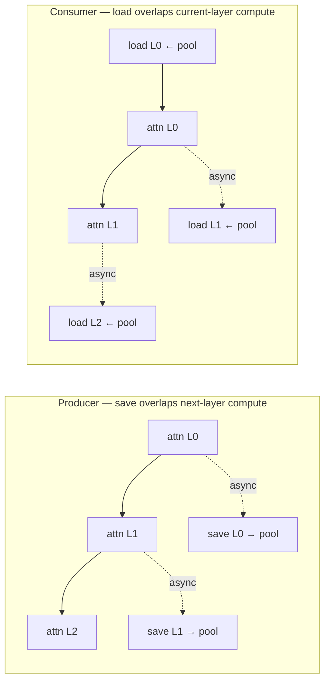

# [RFC]: Layerwise KV Pooling for AscendStore — Memcache vs Mooncake Backend Design

## Motivation.

The AscendStore KV Pool (`AscendStoreConnector`) lets vLLM-Ascend share KV cache
across instances for PD-Mixed and PD-disaggregated serving. It is backed by one of
two production storage backends, chosen at launch time via `kv_connector_extra_config`:

- **memcache** — Huawei Ascend KV-Pool (`memcache_hybrid` / `DistributedObjectStore`),
  addressed by **Global Virtual Address (GVA)**, transported over device RDMA / SDMA /
  host-shared-memory.
- **mooncake** — Mooncake (`MooncakeDistributedStore`), addressed by **object key**,
  transported over the Mooncake transfer engine (ASCEND/RDMA protocol).

Before this work, KV cache was saved to (producer) and loaded from (consumer) the
pool as a **single bulk copy per request** — the entire KV of a request is
transferred *after* the full forward pass completes (save) or *before* it starts
(load). For long prompts this bulk transfer introduces a serialization stall that
directly hurts Time-To-First-Token (TTFT): no forward progress overlaps with the
transfer.

To remove this stall, we proposed a **layerwise KV transfer** approach: split the
save/load at layer granularity and **pipeline the transfer of one layer with the
attention computation of the next**. The transfer latency is then amortized across
the forward pass rather than concentrated as a single blocking step. We implemented
this for the memcache backend in
[#11444](https://github.com/vllm-project/vllm-ascend/pull/11444) (backported to
`releases/v0.23.0` as
[#11585](https://github.com/vllm-project/vllm-ascend/pull/11585)).

However, during implementation we found that memcache and mooncake have
**fundamentally different addressing and transfer models**, which forces the
layerwise path to fork into two parallel implementations:

- memcache is **GVA-based**: a single blob is allocated per (block, rank); all layers
  of a block live in that one blob and are addressed by `GVA + layer_offset`. The
  transfer is a raw device `batch_copy` between HBM and the pool, gated by
  per-process **leases**.
- mooncake is **key-based**: one object is stored per (block, layer, rank); the store
  manages placement internally. The transfer is a `batch_put` / `batch_get` over the
  transfer engine, with no GVA and no lease.

## Proposed Change.

### Layerwise transfer pipeline (shared by both backends)

The orchestration skeleton is backend-agnostic. The producer submits each layer's KV
to a background **send thread** right after that layer's attention; the next layer's
compute overlaps with the transfer. The consumer, before computing layer *i*,
calls `wait_for_layer_load(i)` on a **recv thread** that prefetches layer *i* (and
optionally `i+1..i+k` via `layerwise_prefetch_layers`). A per-layer NPU stream event
(`sync_save_events`) guarantees HBM KV is ready before any copy, and an
`AttentionComputeStartGate` (an NPU event recorded on the compute stream right before
the attention op) makes prefetch loads start only at the attention boundary, so H2D /
L2G work does not contend with the preceding non-attention compute.



*Solid arrow = sequential dependency (the next step waits); dashed `async` arrow = a
transfer spawned in parallel with the adjacent compute. The fork after each `attn Lx`
is the overlap: on the producer, `save Lx` runs while `attn L(x+1)` computes; on the
consumer, `load L(x+1)` is prefetched while `attn Lx` computes — so the transfer
stall is hidden.*

What **differs** between the two backends is everything *inside* the send/recv
threads: the addressing model, the store API, the allocation site, the lease
lifecycle, and the hit-check. The rest of this section describes those differences.

### Two addressing models: GVA vs Key

This is the root cause of the divergence.

**memcache (GVA path).** For each block (per rank), the worker allocates a single
contiguous blob in the pool and obtains its **GVA**. All layers of that block are
written into different byte offsets of the same blob
(`dest_gva = base_gva + layer_id * page_size_bytes`). The store key is minimal —
`{model}@{block_hash}@{head_or_tp_rank}` — and carries **no layer id**, because one
blob holds every layer.

**mooncake (Key path).** Each (block, layer, rank) triple is a **separate object**
with a rich key built by `PoolKey`/`LayerPoolKey`:
`{model}@pcp..@dcp..@head_or_tp_rank:..@pp_rank:..@group:..@cache_role:..@cache_family:..@layer_id:..@{chunk_hash}`.
There is no GVA and no blob; the store places each object itself and reads/writes go
through the transfer engine.

```
 memcache — one blob / block (layers share a blob, addressed by GVA offset)
 ┌──────────── block blob (rank r) ────────────┐
 │ layer0 KV │ layer1 KV │ layer2 KV │ ...      │  ← dest = base_gva + L*page_bytes
 └──────────────────────────────────────────────┘
   key = {model}@{hash}@{head_or_tp_rank}        (no layer_id)

 mooncake — one object / (block, layer, rank)
 layer0: {model}@...@layer_id:0@{hash}   ─┐
 layer1: {model}@...@layer_id:1@{hash}   ─┤  each is an independent store object
 layer2: {model}@...@layer_id:2@{hash}   ─┘   (no GVA; store manages placement)
```

### Save path divergence

**memcache.** The save does **not** call the high-level `Backend.put`. Instead the
worker first allocates GVAs (`batch_alloc`), pre-computes shared per-block data once
(block ids + gvas arrays, reused across layers), and the send thread issues a raw
device copy `batch_copy(..., direction=COPY_L2G)` into the pre-allocated blob. A
per-process GVA cache is kept because `batch_alloc` is non-idempotent (re-allocating
an existing key returns `MMC_DUPLICATED_OBJECT` without registering the blob).

**mooncake.** The send thread splits each block key into per-layer keys
(`key.split_layers(...)[layer_id]`), skips already-stored keys via `batch_is_exist`,
and calls `Backend.put`, which under the hood is
`batch_put_from_multi_buffers(keys, addrs, sizes, ReplicateConfig)`. No
pre-allocation; the store owns placement.

```
 memcache save (per layer L):                mooncake save (per layer L):
   [only tp_rank % put_step == 0]              stride-slice blocks across ranks
   batch_alloc  → GVA per block  (once)        (no alloc)
   batch_copy(L2G, GVA+L*page, HBM, size) ──►  batch_put_from_multi_buffers ──►
                                              store (ReplicateConfig)
```

### Load path divergence

**memcache.** The worker first resolves GVAs and acquires read **leases**: for each
key it calls `batch_get_key_info` (returns the GVA/size only when the blob is fully
saved) then `batch_add_lease` (TTL = 5 min, covering the full multi-layer load
window). The recv thread then issues `batch_copy(..., direction=COPY_G2L)` from pool
GVA into HBM, and after the **final layer** releases all leases with
`batch_remove_lease`. Every rank reads (no `put_step` gate on load).

**mooncake.** The recv thread builds per-layer keys and calls `Backend.get`, which is
`batch_get_into_multi_buffers`. No GVA, no lease, no per-process tracker — the
transfer engine + `ReplicateConfig` handle buffer ownership/replication directly.

**Why memcache needs leases but mooncake does not.** memcache `batch_copy(G2L)` can
only read a blob that is registered in the **per-process `gvaBlobTracker`**;
`batch_add_lease` both registers the blob locally and pins it for the duration of the
asynchronous multi-layer copy. The lease must outlive *all* layers' G2L copies (the
code references "all 27 layers of batch_copy G2L"), hence the 5-minute TTL and the
explicit release after the final layer. Mooncake has no such per-process tracker, so
nothing analogous is needed.

### Allocation site: why GVA allocation moved from scheduler to worker

In the non-layerwise design the scheduler performed allocation. For memcache
layerwise we moved `batch_alloc` **from the scheduler to the worker**, because
memcache's `gvaBlobTracker` is **per-process**: `batch_alloc` and `batch_copy` must
execute in the *same* process. The scheduler is a single metadata client and cannot
satisfy this. So the scheduler now only generates block keys for memcache and leaves
`block_gvas` empty for each worker to fill per-rank. Mooncake has no GVA concept and
needs no allocation step at all, so it is unaffected.

### Hit-check divergence

To decide how many tokens of a request can be served from the pool, the scheduler
probes block existence — and the two backends cannot share the same probe:

- **memcache** uses `batch_get_key_info` and treats `size > 0` as a hit. It cannot
  use `batch_is_exist`, because `batch_alloc` **creates the blob before data is
  written** by `batch_copy(L2G)` — a mere existence check would be a **false
  positive** (blob allocated but not yet filled). `batch_get_key_info` returning a
  valid GVA/size reflects the save-complete state required for the G2L read.
- **mooncake** uses `batch_is_exist` with per-layer keys. Each layer is a distinct
  object that only appears after a successful `put`, so existence == save-complete.

### put_step: MLA vs GQA rank sharding

`put_step` decides how many TP ranks cooperate to save a single KV blob, and thus
how many distinct store keys exist per block. It is `tp_size // num_kv_head` when
`num_kv_head < tp_size`, else `1`; and `head_or_tp_rank = tp_rank // put_step`.

- **MLA** (`num_kv_head = 1`): `put_step = tp_size`, so all ranks share
  `head_or_tp_rank = 0` → **one key per block**, and only `tp_rank % put_step == 0`
  (rank 0) allocates + saves; every rank reads that same blob.
- **GQA** (`num_kv_head >= tp_size`): `put_step = 1`, so each rank has a distinct
  `head_or_tp_rank` → **one key per (block, rank)**, and every rank saves and reads
  its own.

The sharding *mechanism* also differs: memcache uses an early-return gate
(`tp_rank % put_step != 0` skips save), while mooncake additionally uses a stride
slice (`[tp_rank % put_step :: put_step]`) inside the send thread. Load is ungated
for both — every rank issues reads for its own `head_or_tp_rank` keys.

### Synchronization and error handling

The **event-based pipelining** (per-slot `layer_load/save_finished_events`, the NPU
`sync_save_events`, the `AttentionComputeStartGate`, and the ready-event handshake
between the main thread and each transfer thread) is shared by both backends. What
differs are the thread classes and transfer primitives: memcache uses
`KVCacheStoreLayer{Sending,Recving}Thread` with raw `batch_copy` plus H2D-stagger and
transfer-size limiting (`max_transfer_blocks` / `max_transfer_bytes`); mooncake uses
`KVCacheStoreKeyLayer{Sending,Recving}Thread` calling `put`/`get` directly, with no
stagger or size-limiting.

On **error handling**, both backends log-and-continue at the worker level rather than
crash the serving process on a KV-pool transfer failure (memcache logs explicit
"continuing without crash" for `batch_alloc` / `batch_get_key_info` / `batch_add_lease`
/ `batch_copy` failures). We are aware the PR review flagged that silently proceeding
after a failed copy/load-timeout can let attention run on uninitialized or stale
memory, risking silent correctness corruption. We'd like feedback on whether
layerwise transfer failures should instead abort the request (fail-fast) — see the
open questions below.

### Current limitation and proposed direction

Layerwise mode currently **requires the memcache backend**; `mooncake` and `yuanrong`
do not support `use_layerwise`. It also does not yet integrate with context-parallel
attention backends or hybrid (multi-KV-cache-group) models.

We propose the following direction and seek agreement:

1. Accept the GVA-vs-Key divergence as the documented design (this RFC as the
   canonical reference), rather than an accidental implementation detail.
2. Clean up the dead scheduler-side allocation code left over from the pre-layerwise
   design.
3. Decide the error-handling policy: log-and-continue (availability) vs. raise
   (correctness/fail-fast).
4. Optionally **unify the abstraction** behind a common "layer transfer task"
   interface, if the GVA-vs-Key split is not fundamental.
5. Optionally **extend layerwise to mooncake**, deciding which path is the reference
   and whether mooncake's per-layer-key model can support the same pipelining
   semantics without GVA.

### Open questions

- Is the GVA-vs-Key divergence an acceptable long-term design, or should it be
  unified?
- Should layerwise be extended to mooncake, and if so, which path is the reference?
- Should a layerwise transfer failure abort the request (fail-fast) instead of
  logging and continuing?

## Feedback Period.

Two weeks from posting (through ~2026-07-22).

## Co-Authors

[@ader47](https://github.com/ader47)

## CC List.

[@zzzzwwjj](https://github.com/zzzzwwjj) [@Pz1116](https://github.com/Pz1116)
[@LCAIZJ](https://github.com/LCAIZJ) [@MengqingCao](https://github.com/MengqingCao)
[@Yikun](https://github.com/Yikun) [@wangxiyuan](https://github.com/wangxiyuan)
[@weijinqian0](https://github.com/weijinqian0) [@whx-sjtu](https://github.com/whx-sjtu)

## Any Other Things.

- Reference PRs: [#11444](https://github.com/vllm-project/vllm-ascend/pull/11444)
  (main branch) → [#11585](https://github.com/vllm-project/vllm-ascend/pull/11585)
  (backport to `releases/v0.23.0`).
- User guide:
  [`layerwise_kv_pool.md`](https://github.com/vllm-project/vllm-ascend/blob/releases/v0.23.0/docs/source/user_guide/feature_guide/layerwise_kv_pool.md)
  (prerequisites, configuration, tuning, supported models, limitations).
- Verification (from #11585): DeepSeek-V2-Lite-Chat, MLA, 27 layers, TP=8; GSM8K
  69.9% (official 72.0%), TTFT +16% vs non-layerwise, external hit rate 87.2%
  (repeat_rate=0.9); no `ConsumePendingHole` / `MMC_UNMATCHED_KEY` /
  lease-expiration errors. memcache dependency: `memfabric_hybrid` develop branch,
  commit `abd20b8e418fdcb4ea065c4079e8e09943014b12`.
